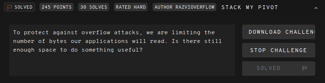
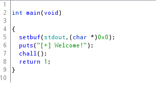
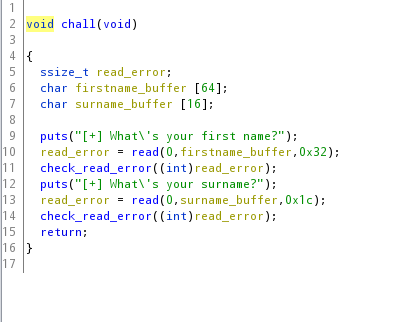

# 247ctf-Stack-my-Pivot-Writeup
Try this challenge for yourself [here](https://247ctf.com/).


I found no writeup online for this challenge so here is one.

So There is the challenge:


We learn that the buffers will be small.
Let's look at it inside ghidra.

## Ghidra



Nothing interesting in the main function, let's look at the chall function.



So two buffers, the first one is large but cannot be overflowed the second is very small but can be overflowed by 8 bytes.

It appears simple enough, put some shellcode inside the first one, jump to it from the second one.

Let's analyze all this in gdb.


## GDB

First let's check security and permissions.
> checksec ./stack_my_pivot

```
Arch:     amd64-64-little
RELRO:    Partial RELRO
Stack:    No canary found
NX:       NX disabled
PIE:      No PIE (0x400000)
RWX:      Has RWX segments
```


I was really stuck on this challenge and the creator [Razvi](https://twitter.com/Razvieu) had the kindness of helping me ! Thanks to him for his time and for the challenge.